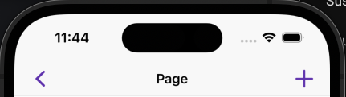
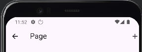

### Material
##### demo


##### code
``` dart frame="terminal"
import 'package:flutter/material.dart';

AppBar(
    title: const Text('Page'),
    actions: const [
        Icon(Icons.add),
    ],
    leading: const Icon(Icons.arrow_back),
)
```

### Cupertino
##### demo


##### code
``` dart frame="terminal"
import 'package:flutter/cupertino.dart';

CupertinoNavigationBar(
    middle: Text('Page'),
    trailing: Icon(CupertinoIcons.add),
    leading: Icon(CupertinoIcons.back),
);
```

## Further reading

- Read [AppBar](https://api.flutter.dev/flutter/material/AppBar-class.html) in the Flutter API documentation.
- Read [CupertinoNavigationBar](https://api.flutter.dev/flutter/cupertino/CupertinoNavigationBar-class.html) in the Flutter API documentation.