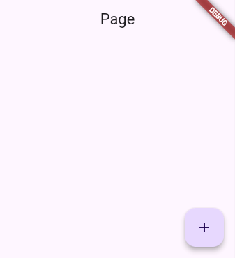

### Material
##### demo


##### code
``` dart frame="terminal"
import 'package:flutter/material.dart';

Scaffold(
    appBar: AppBar(
        title: const Text('Page'),
    ),
    body: SizedBox(),
    floatingActionButton: FloatingActionButton(
        onPressed: () => print('Pressed'), 
        child: Icon(Icons.add),
    ),
)
```

### Cupertino
##### demo


##### code
``` dart frame="terminal"
import 'package:flutter/cupertino.dart';

CupertinoPageScaffold(
    navigationBar: const CupertinoNavigationBar(
        middle: Text('Page'),
    ), // AppBar
    child: Stack(
        children: [
          const SizedBox(), // body
          Positioned(
            bottom: 16.0,
            right: 16.0,
            child: CupertinoButton(
              child: const Icon(CupertinoIcons.add),
              onPressed: () {},
            ), // floatingActionButton
          ),
        ],
    ),
);
```

## Further reading

- Read [Scaffold](https://api.flutter.dev/flutter/material/Scaffold-class.html) in the Flutter API documentation.
- Read [CupertinoPageScaffold](https://api.flutter.dev/flutter/cupertino/CupertinoPageScaffold-class.html) in the Flutter API documentation.